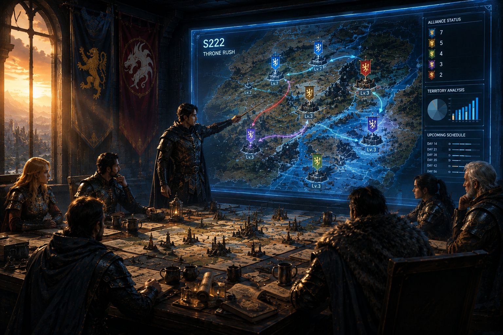
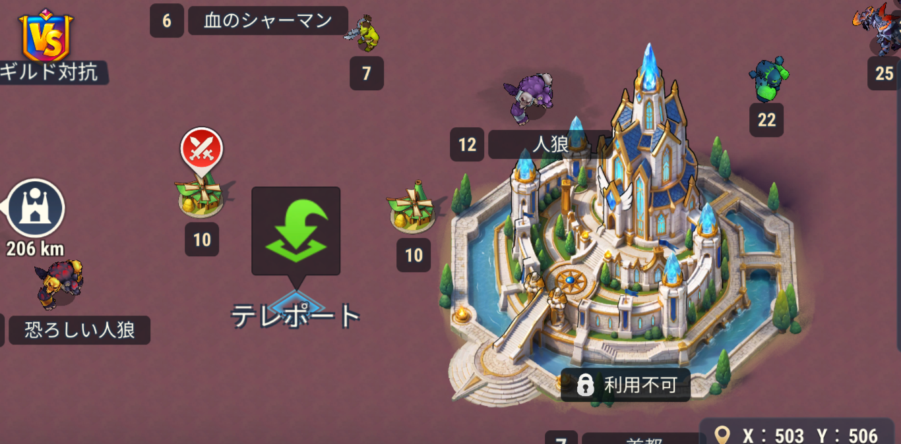
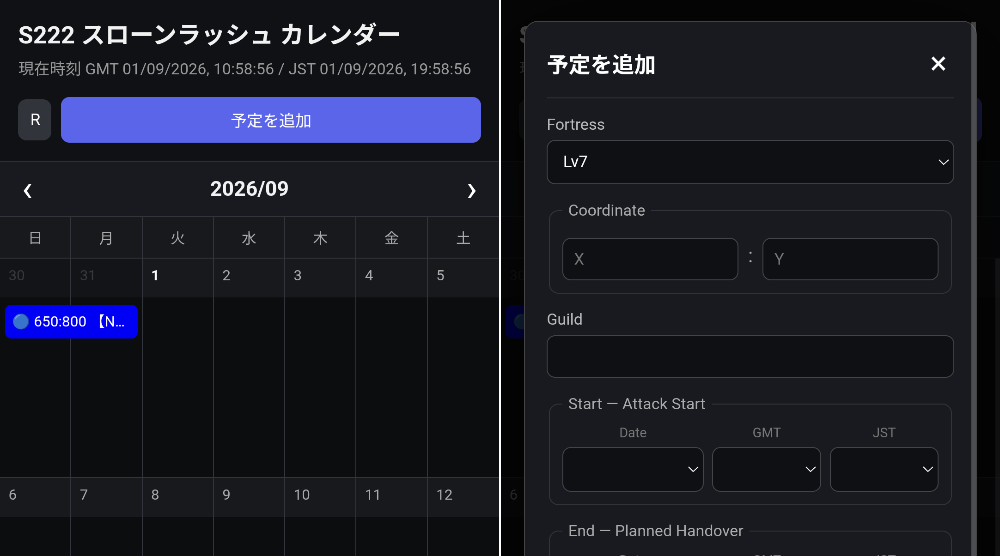
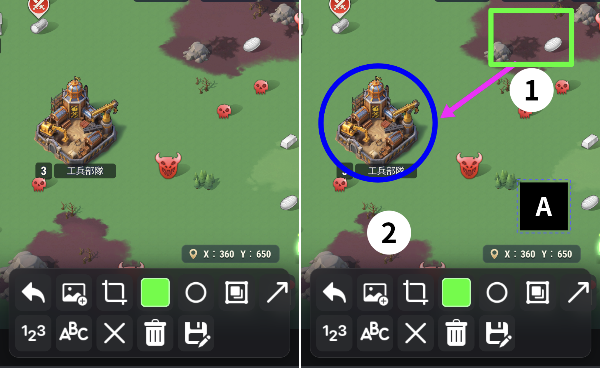
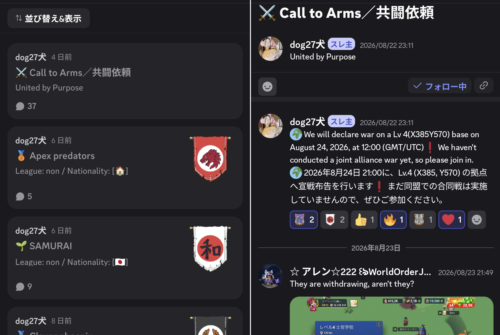
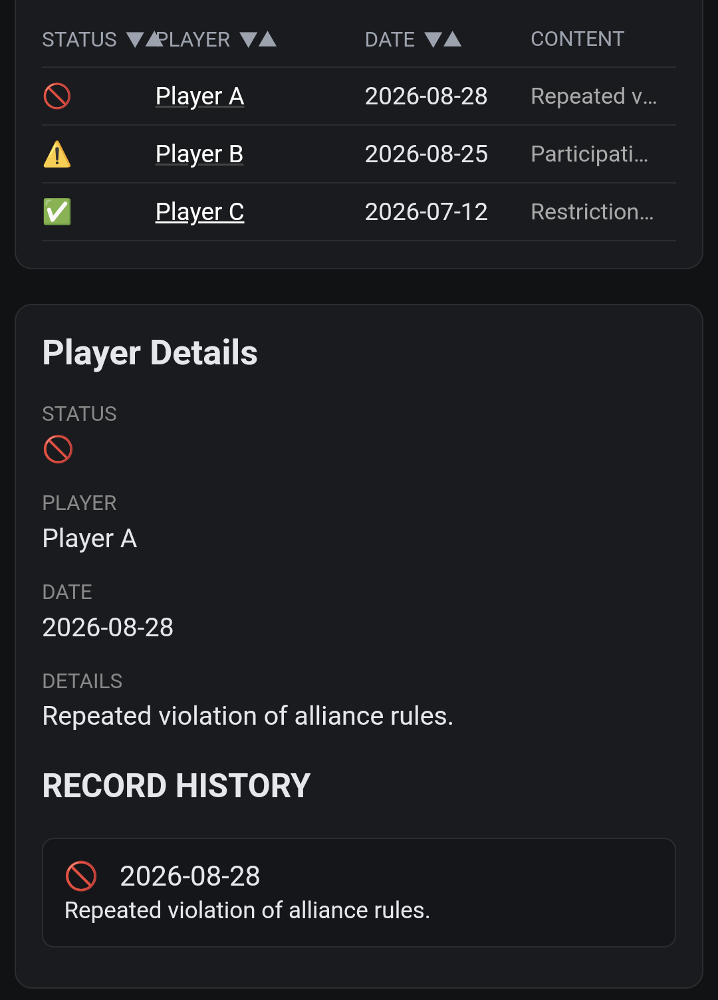
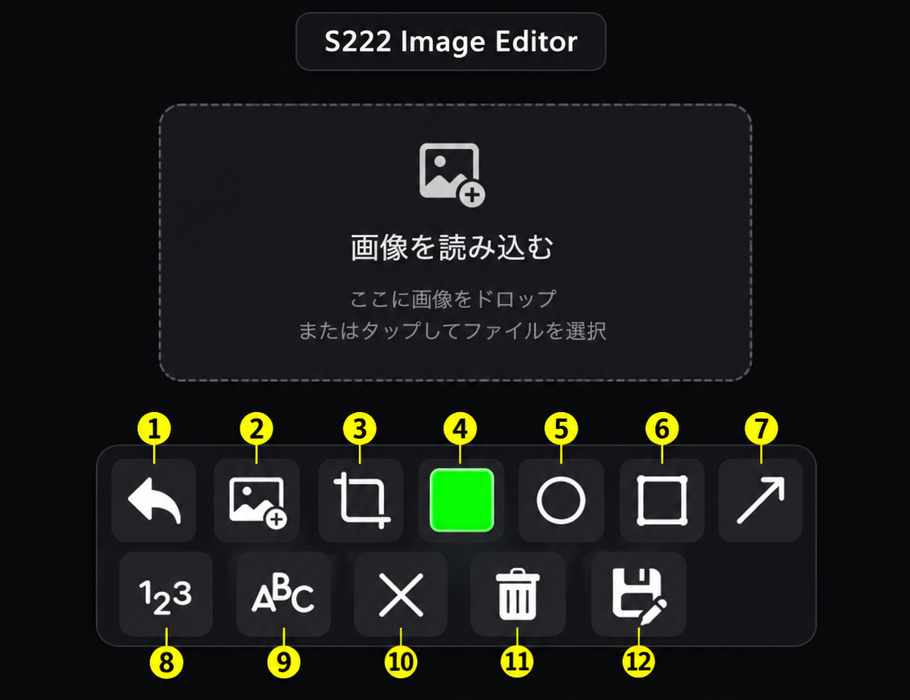

  
🏰 FORTRESS

## Overview

This alliance site provides an environment where participating guilds can share information and act while keeping track of the current situation.

Through information sharing, each guild can make its own decisions while securing benefits more fairly and efficiently.

This manual explains the alliance rules, participation requirements, FAQ, and other relevant information.

## Lv1–4 Fortresses

Lv4 FORTRESS

Target League
<strong>No specific</strong>

Fortresses
<strong>7</strong>

Imperial Guards
<strong>90</strong>

Requirement
<strong>Defeat 75 Guards at Lv3</strong>

Attack Cost
<strong>10 Energy</strong>

At Lv1–4, act according to your own judgment while avoiding unnecessary conflicts between alliance guilds.

### Basic Considerations

* Do not recapture a fortress occupied by another alliance guild without prior discussion.
* If recapture is necessary, coordinate with the guild currently occupying the fortress beforehand.
* If multiple guilds target the same fortress, coordinate the situation with the guilds involved.
* When necessary, consider changing your target or voluntarily withdrawing.
* Avoid unnecessary conflicts and prioritize practical solutions.

From Lv4 onward, coordination between guilds becomes increasingly important.

Use the various tools available on the alliance site to share information and coordinate as needed.

## Lv5 Fortress

Lv5 FORTRESS

Target League
<strong>Bronze League</strong>

Fortresses
<strong>4</strong>

Imperial Guards
<strong>120</strong>

Requirement
<strong>Defeat 90 Guards at Lv4</strong>

Attack Cost
<strong>10 Energy</strong>

From Lv5 onward, coordination between alliance guilds becomes increasingly important.

### Coordinated Capture

When multiple guilds are involved with the same fortress, prior information sharing and coordination are required.

To avoid conflicts, **always register the fortress and your planned schedule in 【Calendar】.**

If multiple guilds plan to attack the same fortress, **the guild that registered first has priority.**

The **【Image Editor】** can also be used to share information on the map.

## Lv6 Fortress

Lv6 FORTRESS

Target League
<strong>Silver League</strong>

Fortresses
<strong>3</strong>

Imperial Guards
<strong>150</strong>

Requirement
<strong>Defeat 120 Guards at Lv5</strong>

Attack Cost
<strong>10 Energy</strong>

At Lv6, **communication becomes even more important** between guilds.

### Communication

Always use **【Forum】** for communication and coordination between guilds.

By leaving information in the forum, not only the guilds directly involved but also other registered alliance guilds can review the situation.

The **management will not be involved in discussions conducted through methods that cannot be reviewed within the alliance**, such as private messages.

Share necessary information and leave it in a form that can be reviewed later.

## Lv7 Fortress

Lv7 FORTRESS

Target League
<strong>Gold League</strong>

Fortresses
<strong>1</strong>

Imperial Guards
<strong>---</strong>

⚠️ Not yet implemented

  
📘 INFO

## Restriction

Participation in the alliance is based on the ability to maintain cooperative relationships between participating guilds.

Actions that directly damage cooperation within the alliance, such as attacking another alliance guild, are subject to participation restrictions.

Other serious issues that may affect participation in alliance activities may also result in participation restrictions, depending on the circumstances.

### Restriction List

Players with confirmed issues relevant to participation restrictions are listed for reference.

Participating guilds can check whether any of their members are included on the list when necessary.

※Status　✅＝OK　⚠️＝WARNING　🚫＝RESTRICTED

### Important

For detailed criteria regarding participation restrictions, as well as review and re-participation procedures, please refer to the separate Participation Restriction Policy.

  
🛠️ TOOLS

## Calendar

The Schedule Coordination calendar is provided for guilds to share information about their planned fortress operations.

You can register the target fortress, location, guild name, planned activity period, and other relevant information.

The main purpose of the calendar is to make each guild's plans visible before conflicts occur.

### Recommended Use

Before declaring war on a limited number of fortresses, check whether other participating guilds have already registered plans for the same target.

When registering an operation, provide enough information for other guilds to understand the planned activity.

If schedules overlap, contact the relevant guilds directly before beginning the operation.

### Important Note

Registering a schedule does not automatically establish ownership or priority over a fortress.

The calendar is an information-sharing tool designed to make each guild's intentions visible and provide a basis for discussion.

The calendar works most effectively when participating guilds keep their schedules as accurate as possible and update them when circumstances change.

## Image Editor

The Image Editor is a tool designed to easily create visual information for coordination between guilds.

You can add visual elements such as markers, arrows, circles, rectangles, numbers, and text to screenshots or map images.

It is designed to make operational information easier to understand and share without requiring professional image editing software.

①
Undo

②
Image Upload

③
Cut Out

④
Color Selection

⑤
Circle

⑥
Rectangle

⑦
Arrow

⑧
Number Object (123)

⑨
Text Object (ABC)

⑩
Delete Selected Object

⑪
Delete All Objects

⑫
Save Image

### Example Uses

* Highlight target fortresses
* Show attack routes
* Highlight important locations
* Add numbered instructions
* Create images for discussions on Discord
* Visually explain coordinated operations

The tool is designed for quick and practical communication, especially when sharing information from mobile devices.

## Forum

The Forum is a place for ongoing discussions in a more organized format than regular chat messages.

It can be used for ongoing discussions, coordination, proposals, and information sharing between participating guilds.

### Recommended Use

For discussions that require multiple messages or need to be reviewed continuously later, create a topic.

Use a clear title so that other participants can immediately understand its purpose.

When decisions or conclusions are reached, summarize the relevant results clearly when necessary.

The Forum is intended to supplement direct communication.

For urgent operational coordination, contacting the relevant guilds directly is the fastest and most reliable method.

  
❓ FAQ

## Rules

### Basic Principle
The alliance site does not establish a hierarchy between participating guilds. Each guild remains independent and cooperates through information sharing and coordination.

### Communication
When carrying out activities that may affect other guilds, communicate with the relevant guilds in advance.

### Information Sharing
Prioritize accurate, fact-based information when sharing information within the alliance. Avoid intentionally spreading misleading information for the purpose of disrupting coordination.

### Conflict Resolution
Guilds should first resolve issues between the parties involved. The alliance site may review the situation when it directly affects alliance activities.

### Participation
Participation in the alliance site is based on the ability to maintain the necessary communication and cooperation with other participating guilds.

## Faq

Q

I want to teleport, but I can't.

A

Return all troops to your castle before teleporting.

You cannot teleport while troops are outside your castle for activities such as hunting monsters, gathering resources, or defending a fortress. You also cannot teleport if there are obstacles such as monsters or bosses at the destination. Remove the obstacles first.

Q

When should I teleport?

A

Complete your teleportation before the event begins.

If you move after the event has started, you may not be able to secure the location you planned to occupy.

Q

How many fortresses are there at each level?

A

Lv1 (38), Lv2 (22), Lv3 (12), Lv4 (7), Lv5 (4), Lv6 (3), Lv7 (1)

As the fortress level increases, the number of fortresses decreases, making coordination between guilds increasingly important from Lv4 onward.

Q

What happens to the Imperial Guards if an occupation attempt fails?

A

The number of Imperial Guards returns to its original amount.

For example, if you attack a fortress with 90 Imperial Guards and defeat 89 of them, the number will return to 90 if the occupation attempt fails.

Q

Which GW League can challenge each fortress level?

A

The required GW League depends on the fortress level.

<ul class="faq-level-list">

<li><strong>Lv5:</strong> Bronze League</li>

<li><strong>Lv6:</strong> Silver League</li>

<li><strong>Lv7:</strong> Gold League</li>

</ul>

You can check the required League by tapping the fortress in the game.

